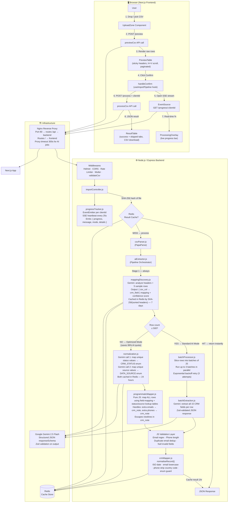

# GrowEasy — AI-Powered CSV Importer

An intelligent CSV importer that accepts messy, unstructured CSVs from any source — Facebook Ads, Google Ads, Excel, Real Estate CRMs, custom spreadsheets — and maps them to structured GrowEasy CRM leads using Google Gemini AI.

---

## System Design

Paste the following into [mermaid.live](https://mermaid.live) to view the full architecture diagram:



---

## Tech Stack

| Layer | Technology |
|---|---|
| **Frontend** | Next.js 14 (App Router), React, Redux Toolkit, Framer Motion, Lenis (smooth scroll) |
| **Backend** | Node.js, Express |
| **AI** | Google Gemini 2.5 Flash (`@google/generative-ai`) with structured JSON schema |
| **Validation** | Zod (runtime schema validation on all Gemini outputs) |
| **CSV Parsing** | PapaParse |
| **Cache & Rate Limiting** | Redis (ioredis), express-rate-limit |
| **Infrastructure** | Nginx Reverse Proxy, Docker, Docker Compose |
| **Deployment** | Vercel (Frontend), Render (Backend) |

---

## Application Flow (Step by Step)

### Step 1 — Upload CSV
- The user drops or picks any CSV file via the drag-and-drop `UploadZone`.
- The frontend immediately calls `POST /api/v1/import/preview` with the raw file.
- The backend parses the CSV using PapaParse (trims headers, trims cell values, skips empty rows) and returns the first 200 rows along with the full row count.
- **No AI runs here.** The response is instant.

### Step 2 — Preview
- The `PreviewTable` component renders the raw rows in a responsive table with:
  - Sticky column headers (always visible while scrolling)
  - Horizontal scroll for wide CSVs
  - Vertical scroll fixed at 440px height
  - Pagination (100 rows per page)
  - Row count and column count badges

### Step 3 — Confirm & AI Processing
- The user clicks **"Confirm & Process with AI"**.
- The frontend generates a unique `clientId` (e.g. `job-lx3k5y-abc123z`).
- It opens a **Server-Sent Events (SSE)** connection to `GET /api/v1/import/progress/:clientId` before the main request, so progress starts streaming immediately.
- It calls `POST /api/v1/import/process?clientId=<id>` with the CSV file.

#### Backend Processing Pipeline

**Cache Check:**
The backend computes a SHA-256 hash of the raw file buffer and checks Redis. If the same file was processed in the last hour, it returns the cached result instantly with a `fromCache: true` flag.

**If no cache — AI Pipeline begins:**

**Stage 1 — Schema Discovery (`mappingDiscovery.js`):**
- Sends the CSV column headers + first 5 data rows to Gemini with one API call.
- Gemini returns a `{ csv_column → crm_field }` mapping object and a `confidence` score (0–1).
- This result is cached in Redis for 7 days keyed by a SHA-256 hash of the sorted column names — so the same column schema never costs an AI call twice.

**Stage 2 — Pipeline Routing (`aiExtractor.js`):**
The extractor checks the total row count and whether a quota exhaustion flag exists in Redis, then routes to one of two modes:

**Mode A — Standard AI Mode (≤ 500 rows):**
- Splits rows into batches of 25.
- Runs up to 3 batches concurrently via `batchProcessor.js`.
- Each batch is sent to Gemini with the field mapping and strict extraction rules (status enum, source enum, date format, multiple email/phone handling, skip logic).
- Failed batches are retried up to 3 times with exponential backoff (500ms → 1s → 2s).
- Gemini response is validated against a Zod schema before use.

**Mode B — Production-Optimized Mode (> 500 rows):**
- Extracts all **unique** status and source string values from the full CSV.
- Sends one Gemini call to normalize all unique status values to the 4 allowed `CRM_STATUS` values.
- Sends one more Gemini call to normalize all unique source values to the 5 allowed `DATA_SOURCE` values.
- Both lookup tables are cached in Redis for 24 hours.
- Maps **all rows** programmatically in JavaScript using the field mapping + lookup tables — zero additional AI calls.
- Result: 2–3 total Gemini calls for a file of any size vs. 2,000 calls for 50,000 rows.

**Stage 3 — JavaScript Validation Layer (always runs):**
After AI extraction, every record is validated in JS:
- Email must match regex (`/^[^\s@]+@[^\s@]+\.[^\s@]+$/`)
- Phone must be at least 7 digits
- Duplicate emails are detected via a `Set` and moved to skipped
- Records with neither a valid email nor a valid phone are skipped with a reason

**Stage 4 — Normalisation (`crmMapper.js`):**
- `created_at` → converted to ISO 8601 string, nulled if unparseable
- `email` → lowercase, trimmed, nulled if invalid
- `mobile_without_country_code` → stripped of spaces/dashes/parentheses, country code digits stripped if prepended, leading zeros removed
- `country_code` → `+` prefix enforced
- `crm_status` → nulled if not in the 4-value enum
- `data_source` → nulled if not in the 5-value enum
- All string fields → trimmed, empty strings → `null`

**Result is cached in Redis for 1 hour** by file hash before responding.

### Step 4 — Results
- The `ResultTable` displays:
  - **Stat Cards**: Total rows, imported, skipped, mapping confidence, extraction mode, cache status
  - **Success Tab**: All extracted CRM records in a responsive paginated table with live search
  - **Skipped Tab**: Records that failed validation with a clear reason for each
  - **CSV Download**: One-click download of the clean, GrowEasy-formatted CSV
  - **New Import button**: Resets the entire wizard back to Step 1

---

## CRM Fields Extracted

| Field | Description |
|---|---|
| `created_at` | Lead creation date (ISO 8601) |
| `name` | Lead full name |
| `email` | Primary email address |
| `country_code` | Dialling code (e.g. `+91`) |
| `mobile_without_country_code` | Mobile number without country code |
| `company` | Company name |
| `city` | City |
| `state` | State / Province |
| `country` | Country |
| `lead_owner` | Lead owner (email or name) |
| `crm_status` | `GOOD_LEAD_FOLLOW_UP` · `DID_NOT_CONNECT` · `BAD_LEAD` · `SALE_DONE` |
| `crm_note` | Remarks, follow-up notes, extra emails, extra phones |
| `data_source` | `leads_on_demand` · `meridian_tower` · `eden_park` · `varah_swamy` · `sarjapur_plots` |
| `possession_time` | Property possession time |
| `description` | Additional description |

---

## Backend API Reference

| Method | Endpoint | Description |
|---|---|---|
| `GET` | `/api/v1/health` | Health check — returns `{ status: "ok" }` |
| `POST` | `/api/v1/import/preview` | Upload CSV → returns headers + first 200 rows. No AI. |
| `GET` | `/api/v1/import/progress/:clientId` | SSE stream for real-time progress of an AI job |
| `POST` | `/api/v1/import/process?clientId=<id>` | Upload CSV → full AI extraction → returns CRM records |

---

## Frontend Folder Structure

```
src/
├── app/
│   ├── page.tsx                 # Landing page (hero, features, how it works, footer)
│   └── dashboard/
│       └── page.tsx             # 4-step import wizard container
├── components/
│   ├── FloatingNavbar.tsx       # Sticky top navigation with theme toggle
│   ├── UploadZone.tsx           # Drag-and-drop / file picker
│   ├── PreviewTable.tsx         # Raw CSV preview (sticky, scrollable, paginated)
│   ├── ProcessingOverlay.tsx    # Real-time AI progress display
│   ├── StepIndicator.tsx        # 4-step wizard progress bar
│   ├── ResultTable.tsx          # AI result display (success + skipped tabs)
│   ├── ThemeToggle.tsx          # Dark / light mode toggle
│   └── landing/
│       ├── CsvImportPreview.tsx # Hero section mockup card
│       ├── FeaturesSection.tsx  # Features grid
│       ├── HowItWorksSection.tsx# 3-step how it works
│       └── Footer.tsx           # Dark footer with links
├── hooks/
│   └── useImportPipeline.ts     # All import logic (SSE, API calls, state dispatch)
├── services/
│   └── api.ts                   # Axios client + previewCsv / processCsv / subscribeToProgress
├── store/
│   ├── store.ts                 # Redux store setup
│   ├── importSlice.ts           # Import state (step, headers, rows, progress, result)
│   └── hooks.ts                 # Typed useAppDispatch / useAppSelector
└── types/
    └── crm.ts                   # TypeScript interfaces for all CRM types
```

---

## Backend Folder Structure

```
backend/
├── server.js                         # Entry point: Redis connect, server listen, graceful shutdown
└── src/
    ├── app.js                        # Express app: middleware stack, routes, error handler
    ├── config/
    │   ├── index.js                  # Centralised env config (all process.env lives here)
    │   └── redis.js                  # ioredis singleton with lazy connect
    ├── routes/
    │   └── importRoutes.js           # Route definitions with middleware chain
    ├── controllers/
    │   └── importController.js       # HTTP layer: Redis cache check, calls services, SSE progress
    ├── middlewares/
    │   ├── uploadMiddleware.js        # Multer: file type + size validation, in-memory buffer
    │   ├── validateCsv.js            # Must have header + at least 1 data row
    │   ├── rateLimiter.js            # Redis-backed rate limiter on /process
    │   └── errorHandler.js           # Global error handler (Multer, AI quota, 500)
    ├── services/
    │   ├── csvParser.js              # PapaParse: CSV → { headers, rows, totalRows }
    │   ├── aiExtractor.js            # Pipeline orchestrator: routes Standard vs Optimized
    │   ├── crmMapper.js              # Post-AI normaliser: dates, email, phone, enums
    │   └── ai/
    │       ├── geminiClient.js       # Gemini SDK singleton + structured model factory
    │       ├── schemas.js            # Zod schemas + Gemini responseSchema definitions
    │       ├── mappingDiscovery.js   # Stage 1: header schema → CRM field mapping (Redis cached)
    │       ├── batchExtraction.js    # Stage 2: per-row AI extraction with Gemini
    │       ├── normalization.js      # Optimized mode: unique status/source normalization
    │       ├── programmaticMapper.js # Optimized mode: pure JS row mapping
    │       └── errorHelpers.js       # Quota/rate-limit error detection + structured error factory
    └── utils/
        ├── batchProcessor.js         # Concurrent batch runner with retry + progress callback
        ├── progressTracker.js        # Node EventEmitter + SSE handler
        ├── logger.js                 # Winston logger (console + file in prod)
        └── responseHelper.js         # success() / error() response wrappers
```

---

## Setup & Running Locally

### Prerequisites
- Node.js v18+
- A [Google Gemini API Key](https://aistudio.google.com/app/apikey)
- Redis (optional — app degrades gracefully without it)

### Backend
```bash
cd backend
npm install
cp .env.example .env
# Open .env and set GEMINI_API_KEY=your_key_here
npm run dev
# Runs on http://localhost:5000
```

### Frontend
```bash
cd frontend
npm install
cp .env.local.example .env.local
# NEXT_PUBLIC_API_URL is already set to http://localhost:5000/api/v1
npm run dev
# Runs on http://localhost:3000
```

### Using Docker Compose (Full Stack)
```bash
# Set GEMINI_API_KEY in your environment or in a .env file at the project root
GEMINI_API_KEY=your_key docker-compose up --build

# Access the app at http://localhost
```
Starts: Redis → Backend → Frontend → Nginx (port 80).

---

## Environment Variables

### Backend (`backend/.env`)

| Variable | Default | Description |
|---|---|---|
| `GEMINI_API_KEY` | *(required)* | Google Gemini API key |
| `PORT` | `5000` | Backend server port |
| `NODE_ENV` | `development` | Environment (`development` / `production`) |
| `REDIS_URL` | `redis://localhost:6379` | Redis connection URL |
| `AI_BATCH_SIZE` | `25` | Rows per Gemini batch |
| `AI_CONCURRENCY` | `3` | Parallel batches at once |
| `AI_RETRY_ATTEMPTS` | `3` | Max retries per failed batch |
| `MAX_FULL_AI_ROWS` | `500` | Threshold: above this switches to Optimized mode |
| `MAX_FILE_SIZE_MB` | `10` | Max CSV upload size |
| `RATE_LIMIT_MAX_REQUESTS` | `10` | Max /process requests per minute per IP |
| `ALLOWED_ORIGINS` | `http://localhost:3000` | Comma-separated allowed CORS origins |

### Frontend (`frontend/.env.local`)

| Variable | Default | Description |
|---|---|---|
| `NEXT_PUBLIC_API_URL` | `http://localhost:5000/api/v1` | Backend API base URL |

---

## Bonus Features Implemented

| Feature | Detail |
|---|---|
| ✅ Drag & Drop upload | Full drag-and-drop with visual feedback in `UploadZone` |
| ✅ Real-time progress streaming | Server-Sent Events (SSE) with percentage, message, mode, and batch detail |
| ✅ Retry mechanism | Exponential backoff (3 retries) per batch in `batchProcessor.js` |
| ✅ Paginated tables | Both preview and result tables are paginated |
| ✅ Dark mode | Full dark/light toggle with CSS variable-based design system |
| ✅ Docker setup | Docker Compose with Redis, Backend, Frontend, and Nginx |
| ✅ Deployment | Frontend on Vercel, Backend on Render |
| ✅ Redis caching | File result cache (1hr), header mapping cache (7d), status/source cache (24hr) |
| ✅ Production-Optimized AI mode | 2–3 Gemini calls for any file size instead of thousands |

---

## Author

Built for the GrowEasy Software Developer Assignment.
Applied position: **Software Developer Intern**
