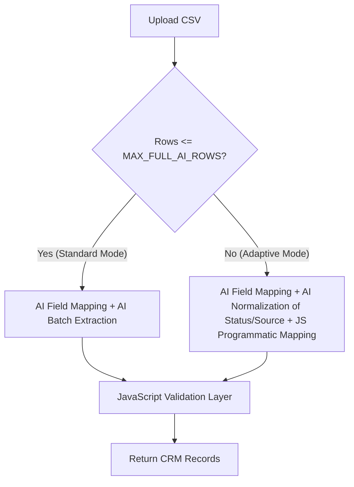

# Implementation Plan - Standard & Adaptive AI Processing Pipeline

Introduce two CSV processing modes (Standard AI vs Adaptive AI) to efficiently process large datasets (e.g., 50k rows) on the Gemini Free Tier while adhering to the assignment's batch extraction guidelines.

## Proposed Architecture

## Proposed Changes

---

### Backend Configuration

#### [MODIFY] [config/index.js](file:///c:/Users/ghosh/OneDrive/Desktop/Project/backend/src/config/index.js)
* Add configuration defaults:
  - `ai.maxFullAiRows` (default `500`, set via `MAX_FULL_AI_ROWS` environment variable)
  - Ensure `ai.batchSize` (default `25`) is fully utilized.

#### [MODIFY] [backend/.env](file:///c:/Users/ghosh/OneDrive/Desktop/Project/backend/.env)
* Expose `MAX_FULL_AI_ROWS=500` and `AI_BATCH_SIZE=25` configuration options.

---

### Real-Time Progress Tracker

#### [NEW] [utils/progressTracker.js](file:///c:/Users/ghosh/OneDrive/Desktop/Project/backend/src/utils/progressTracker.js)
* Implement a server-wide `EventEmitter` to pub/sub progress events per `clientId`.
* Expose:
  - `emitProgress(clientId, { progress, message, mode, details })`
  - Express middleware/handler for `GET /api/v1/import/progress/:clientId` to establish a Server-Sent Events (SSE) stream.

---

### AI Service Layer & Mappings Caching

#### [MODIFY] [services/ai/mappingDiscovery.js](file:///c:/Users/ghosh/OneDrive/Desktop/Project/backend/src/services/ai/mappingDiscovery.js)
* Cache discovered header mapping in Redis using a SHA256 hash of the sorted headers list as the key: `mapping:headers:<hash>`.

#### [NEW] [services/ai/normalization.js](file:///c:/Users/ghosh/OneDrive/Desktop/Project/backend/src/services/ai/normalization.js)
* Implement `mapUniqueStatuses(uniqueStatuses)` and `mapUniqueSources(uniqueSources)` using Gemini structured output.
* Map statuses semantic meanings to allowed values: `GOOD_LEAD_FOLLOW_UP`, `DID_NOT_CONNECT`, `BAD_LEAD`, `SALE_DONE`.
* Map campaign/source name meanings to allowed sources: `leads_on_demand`, `meridian_tower`, `eden_park`, `varah_swamy`, `sarjapur_plots`.
* Cache normalization mappings in Redis under `mapping:status:<value>` and `mapping:source:<value>`.

---

### Process Controller and Router

#### [MODIFY] [routes/importRoutes.js](file:///c:/Users/ghosh/OneDrive/Desktop/Project/backend/src/routes/importRoutes.js)
* Register `GET /progress/:clientId` for SSE progress streaming.

#### [MODIFY] [controllers/importController.js](file:///c:/Users/ghosh/OneDrive/Desktop/Project/backend/src/controllers/importController.js)
* Extract `clientId` from query parameter or request headers.
* Wire up `processCsv` to pass `clientId` down to the extraction orchestrator.

---

### Extraction Pipeline (Adaptive vs Standard)

#### [MODIFY] [services/aiExtractor.js](file:///c:/Users/ghosh/OneDrive/Desktop/Project/backend/src/services/aiExtractor.js)
* Implement the core routing logic:
  - If `rows.length <= config.ai.maxFullAiRows`, run **Standard AI Mode**:
    1. AI Field Mapping
    2. AI Batch Extraction (using `processBatches`)
    3. Programmatic JavaScript Validation Layer (Normalizing numbers/dates/emails, skipping invalid rows).
  - If `rows.length > config.ai.maxFullAiRows`, run **Adaptive AI Mode**:
    1. AI Field Mapping
    2. Extract unique status and source values from CSV.
    3. Normalise unique status/source values via Gemini in 1 request each.
    4. Process all rows in JavaScript using programmatic mappings (headers, status, source) and format (stripping country codes, parsing dates, grouping extra contacts).
    5. Programmatic JavaScript Validation Layer.
* Call `progressTracker.emitProgress` at each checkpoint (e.g. `Parsing...`, `AI Mapping...`, `Batch 4 / 20`, `Saving...`).

---

### Frontend State and Components

#### [MODIFY] [store/importSlice.ts](file:///c:/Users/ghosh/OneDrive/Desktop/Project/frontend/src/store/importSlice.ts)
* Add `processingMode` ('standard' | 'adaptive' | null) and `progressDetails` (e.g., 'Batch 4 / 20') to slice state.
* Update action payloads accordingly.

#### [MODIFY] [app/dashboard/page.tsx](file:///c:/Users/ghosh/OneDrive/Desktop/Project/frontend/src/app/dashboard/page.tsx)
* Generate a unique client/job ID on component mount.
* When confirming import, open SSE connection to `/api/v1/import/progress/:clientId`.
* Pass `clientId` in query string of `/api/v1/import/process`.
* Read real-time progress events and dispatch to Redux store.
* Display custom error messages for quota errors and offer optimized fallbacks.

#### [MODIFY] [components/ProcessingOverlay.tsx](file:///c:/Users/ghosh/OneDrive/Desktop/Project/frontend/src/components/ProcessingOverlay.tsx)
* Render the active AI mode (Full AI vs Adaptive AI).
* Display precise details (e.g., `Processing batch 4 of 20` or `Running deterministic column mapping`).

---

## Verification Plan

### Automated Tests
* Run existing test suites (`npm test` in backend) to verify no regressions on batch processor.

### Manual Verification
1. Upload a CSV of **10 rows** $\rightarrow$ Verify backend logs show **Standard AI Mode** and frontend displays "Full AI Extraction".
2. Upload a CSV of **600 rows** $\rightarrow$ Verify backend logs show **Adaptive AI Mode** and frontend displays "Adaptive AI Processing".
3. Check Redis cache to verify keys for field mappings are populated.
4. Verify error handling by setting an invalid API key and checking toast messages.
